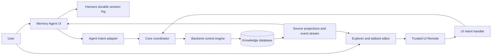

# Knowledge UI design draft

## Status and scope

This document defines the UI framework and data flow for the first Patchouli
surface in DeepSeek Harness Web. It deliberately does not bind the UI to a
business conversation and does not expose the backend CRUD protocol.

The target is DeepSeek Harness `0.1.0-rc.6`. Patchouli ships as a dual-face
Cordis package: the Host half owns trusted coordination and Remote methods,
while `exports["./client"]` contributes the browser UI through the Harness
`dsh.client` manifest.

## Product vocabulary

- **Entry**: one currently visible piece of knowledge, with source, version and
  provenance.
- **Retrieval run**: one direct UI or Agent-initiated query, its filters, ranked
  matches, selected entries and returned payload.
- **Change**: a durable statement that an entry was added, revised, invalidated,
  merged or otherwise changed by the knowledge system.
- **Operation**: a user-requested retrieve or update intent and its execution
  state. An operation is not a raw database mutation.
- **Memory Agent session**: one dedicated, durable Agent conversation used only
  to understand and operate the knowledge base. It is not a business session
  and is not a data-isolation boundary.
- **Filter context**: optional Workspace, Session, source, type and time values
  that narrow a view or operation without changing storage ownership.

## UI container

The browser architecture is a container plus frontend surfaces. These primitives are embedded in `dsh-patchouli-memory-ui`; the former standalone `dsh-ui-container` and `dsh-ui-workspace` packages are deprecated and are not runtime dependencies. The Memory UI installs its browser-local container, connects a unique `surfaceId`, and receives a scoped `UiSurfaceConnection`:

```ts
const { surface, disconnect } = ctx.uiContainer.connectSurface({
  id: 'example.graph',
})

ctx.effect(() => disconnect)
surface.registerSessionHost(sessionId, {
  open: openDocument,
  reveal: revealDocument,
  close: closeDocument,
})
```

The container owns URI-based document providers, reactive subscriptions and
session-host routing only. A surface connection automatically stamps its
`surfaceId` on document resolution and routes
open/close/reveal only to that frontend's session host. Duplicate surface ids
are rejected.

The package also exports a visual `SurfaceHost`. A root host binds a surface
connection and session to a visible DOM boundary. Nested hosts inherit both by
default; providing another connection switches the subtree to that frontend.
Each host publishes its local id and resolved path as data attributes for
inspection and scoped styling:

```tsx
<SurfaceHost surface={memorySurface} sessionId={sessionId}>
  <SurfaceHost id="editor">
    <MemoryEditor />
  </SurfaceHost>
</SurfaceHost>
```

`SurfaceHost` is entirely browser-local. It never serializes React elements or
pre-renders a subtree for transport. A remote provider sends document
projections and revision events through the data contract; Workspace renders
them locally. Container nesting therefore does not increase network traffic.

The embedded workspace layer above the container provides the Explorer pane stack and sashes, tabbed editor, document surface, renderer pipeline and document-action registry. It does not provide a separate Cordis service or claim a Harness slot. The Memory UI can replace one of these primitives or build directly against its container.

Frontends independently register their Harness entry, toolbar, panes, renderer
slots and auxiliary panels, so adding a graph or audit frontend does not modify
the memory frontend.

The same document contract can cross a process or network boundary through the
container's JSON-RPC remote transport. `MessagePort` connects Workers and host
IPC bridges; WebSocket connects separately hosted frontends. The receiver
registers a remote document provider and continues to render with its local
Workspace. Revisions suppress unchanged payloads, while subscriptions transmit
only invalidations. The endpoint owner authenticates and authorizes the channel
before exposing the container; a remote peer never receives the Cordis service
object. Surface open/reveal/close commands require a separate capability that is
disabled by default.

Patchouli connects the first surface as `patchouli.memory`, composes its page
from Workspace presets, and mounts it into Harness's official
`conversation.view` slot. Its domain-specific registries are exposed through
`ctx.patchouliMemoryUi`; they live in neither the container nor Workspace.

## Memory frontend

### Knowledge conversation view

Patchouli registers a native `conversation.view` named **Knowledge**. Harness
renders it in the existing conversation header beside **Conversation** and
**Trajectory**. Selecting Knowledge replaces the center conversation view; it
does not open a sidebar destination, a right-hand details rail, or a separate
page. The ordinary Harness message composer is hidden while Knowledge is the
active view and returns immediately when the user switches back to another
conversation view.

The view defaults to a **current session** filter using the Harness session id.
The range control groups **Current session**, **Workspace**, and **Global** in
one segmented switch. A separate **Custom filters** trigger sits immediately
beside it. Range and custom filters are independent: the visible projection is
their intersection, and opening the custom-filter box never changes the chosen
range. The trigger distinguishes its idle, hover, box-open, and filter-effective
states; box visibility and filter effectiveness are separate facts.

A compact knowledge search field sits immediately to the right of Custom
filters. Focusing or clicking the field opens a non-modal recent-search panel;
Enter records the normalized query, duplicate entries move to the front, and
the eight most recent queries are retained. Selecting a history entry restores
it to the field, while Escape closes only the history panel. Search history is
cached under the active Harness session id and is not shared across sessions.
This UI layer records intent only; backend retrieval and result projection are
connected later.

The right side of the toolbar contains an accessible Edit mode switch. Its
state is cached per Harness session, while acknowledgement of the edit-mode
notice is stored once per installed Patchouli version. The first attempt to
enable Edit mode for that version opens a confirmation dialog explaining the
change in interaction and the coordinator boundary. Cancel leaves browse mode
unchanged; confirmation records acknowledgement and enables Edit mode. Turning
the mode off never prompts.

The non-modal floating configuration box is intentionally empty in the first
UI layer. It remains open across range changes and other page interaction. Only
its close action dismisses it while Knowledge stays active; leaving Knowledge
unmounts the box. Session and Workspace remain filters rather than
storage-isolation boundaries.

Below the range controls, the center surface follows a compact editor layout.
The obsolete title, Library/Activity switch, search bar and filter row are not
part of this surface. Pointer- and keyboard-operable vertical sashes separate
up to three regions. Their bounds derive from the visible regions' minimum
widths, so no region can be collapsed away:

1. **Explorer** — collapsible Open projects, Knowledge, Knowledge relations,
   Files, Logs and Timeline sections. Knowledge, Knowledge relations and Files
   expose recursive trees; the remaining sections expose flat source-defined
   items.
2. **Editor** — one or more closable tabs and the page supplied by the selected
   item's source.
3. **Memory Agent** — an optional in-flow auxiliary surface. Opening it reduces
   the space available to Explorer and Editor instead of covering either one.

Tabs are a shared presentation primitive, not a knowledge-specific page type.
The primitive owns activation, closing, preview/pinning, keyboard traversal,
overflow and empty state only. A source
adapter supplies each tab's stable id, title, icon and page content. Knowledge,
relations, files, logs and timeline can therefore open different page
components without adding new tab implementations.

Explorer itself is fixed to the editor height and never becomes one long scroll
surface while the registered panes' minimum heights fit. Expanded top-level
panes divide the available height and scroll only their own contents. Horizontal
sashes resize them with a conserved total height: dragging downward releases
capacity from the nearest expanded panes below before touching farther panes;
dragging upward does the same above the sash. Every expanded pane retains its
header plus registered minimum body height.

Collapsed panes retain header height. Expanding one compresses the other open
panes down toward their minima; collapsing one redistributes its released space.
As long as all minima fit, lower collapsed headers remain pressed to the bottom.
When the sum of expanded minima and collapsed headers exceeds the Explorer
height, the pane stack switches to one vertically scrollable accordion list.
In that mode lower collapsed headers follow normal document flow rather than
sticking to the viewport bottom. It automatically returns to the fitted layout
when enough panes close or the viewport grows.

The browser caches presentation state under the active Harness `sessionId`.
Each session therefore restores its own scope, Agent-panel visibility and
width, open and active tabs, the one optional preview tab, Explorer width,
top-level pane expansion and heights, and recursive
tree expansion, plus recent search queries. Switching sessions loads a different cache entry instead of
resetting or sharing layout globally. Floating-filter visibility and unfinished
inline change forms are transient interactions and are deliberately not cached.

Top-level panes are registry-driven rather than enumerated by the Explorer
component. A pane contributes a unique id, sort order, initial expanded state,
context-derived title and a render function:

```ts
ctx.patchouliMemoryUi.explorerPanes.register({
  id: 'source-health',
  order: 70,
  defaultExpanded: false,
  minimumBodyHeight: 64,
  title: () => 'Source health',
  render: (context) => <SourceHealth openDocument={context.openDocument} />,
})
```

The render function owns the complete pane body and may return a recursive tree,
a flat list or another React component. `minimumBodyHeight` defaults to 44 px and
must not be negative. Registration updates a mounted Explorer immediately.
Duplicate ids and invalid minima are rejected, and the returned disposer
unregisters the pane for plugin-lifecycle cleanup. The six preview panes are
ordinary built-in registrations using the same public mechanism.

### Theme and locale configuration

Patchouli inherits Harness light and dark tokens by default. Consumers may
override a semantic subset at runtime through the exported `patchouliTheme`
controller; overrides are scoped to the Patchouli root and therefore do not
re-theme the surrounding Harness page:

```ts
import { patchouliTheme } from 'dsh-patchouli/client'

patchouliTheme.set({
  browse: {
    accent: '#4d6bfe',
  },
  edit: {
    accent: '#7c5cff',
    accentMuted: 'rgb(124 92 255 / 14%)',
    surfaceRaised: '#17171c',
  },
})

// Restore ordinary Harness theme inheritance.
patchouliTheme.reset()
```

The edit theme is layered over the browse theme, so it may provide only the
tokens that change. The view root also exposes `data-mode="browse|edit"` for
larger future style changes. Theme configuration covers colors, borders,
shadows, typography and motion easing. Structural layout measurements are intentionally excluded because the
Explorer and pane-stack layout engines use those measurements as interaction
constraints rather than decoration.

All user-facing control labels, preview document names, timestamps, summaries
and tree folder names are locale keys in the Patchouli namespace. Harness owns
the selected language and supplies the bound translator, so switching between
Chinese and English updates open tabs, Explorer rows and details from one source
of truth. Stable ids, source paths and protocol values are not translated.

A **Memory Agent** button opens an auxiliary panel inside the Knowledge view.
The panel will later resume a dedicated durable Agent context that is separate
from the business conversation currently open in Harness. The browser view may
reset filters and selection; Agent history and backend projections remain
durable in their respective authorities.

### Agent

The Memory Agent is an auxiliary conversation panel within Knowledge. Its
composition is restricted to memory-management capabilities: it interprets
user intent and sends retrieve or update intents to the coordinator. It does
not receive raw database CRUD controls, and its durable context is independent
of the selected Harness business session.

The user may attach structured UI context to a message:

- selected entry references;
- active range and custom filters;
- a retrieval run or change reference;
- an optional Workspace or Session filter.

Only stable references are attached to the Agent turn. The coordinator resolves
current entry data, so an old conversation message cannot silently resubmit a
stale editable copy.

### Explorer and editor

Explorer presents the current knowledge projection as navigable source trees.
Selecting a leaf reveals its source-defined page in one replaceable preview tab;
double-clicking the leaf or preview tab pins it. Selecting an already-open leaf
activates its existing tab. The tree follows the standard Explorer keyboard
model: arrows move focus and expand or collapse branches, Home/End jump to the
boundaries, and Enter/Space activates the focused item. Open projects mirrors
the editor tabs, while closing the final tab leaves an explicit editor empty
state.

The first knowledge-detail page shows:

- detail shows content, provenance, current version, change history and
  retrieval appearances;
- **Ask Agent** starts or focuses an Agent turn with the entry reference;
- **Request change** opens an inline intent area for a specific entry.

Workspace and Session are optional filters only. There is no v1 data isolation
or separate knowledge namespace behind them.

### Logs and timeline

Logs and Timeline are Explorer sources that open their records through the same
tab primitive. Their pages may use distinct layouts while retaining common tab
behavior. Logs contain Retrieval runs and Operations; Timeline presents Changes
in chronological order. Type, status, source, Workspace, Session and time can
later narrow those sources through the independent custom filter.

Opening a retrieval shows its query, initiator, filters, ranked candidates,
selected entries and returned payload. Opening an update shows the requested
outcome, proposal, confirmation, resulting changes and affected versions.

## Interaction model

There are two supported paths into the same coordinator:

1. The user talks to the Memory Agent. The Agent converts natural language and
   attached references into a structured retrieve or update intent.
2. The user invokes a direct action from a source-defined editor page. The UI
   plugin's retrieve or update handler converts the form state into the same
   intent shape.

A retrieve intent is read-only and may run immediately. An update intent first
produces an intelligible proposal with targets, expected effect and warnings.
The user confirms or cancels it. Patchouli never presents Create, Update or
Delete database controls.

## State and persistence ownership

| State | Authority | Reload behavior |
| --- | --- | --- |
| Memory Agent messages and context | Harness durable session log | Replayed when the dedicated session opens |
| Entries, versions and provenance | Knowledge backend | Re-read through projections |
| Retrievals, update operations and changes | Knowledge backend | Re-read by cursor and then subscribed live |
| Dedicated Memory Agent session id | Host coordination plugin | Resolved before client navigation |
| Scope, selection and layout | Browser cache keyed by Harness session id | Restored per session; never treated as knowledge truth |
| Floating panels and unfinished form input | Browser UI | Reset when the Knowledge view unmounts |
| Reserved UI participant identity | Trusted Host Remote | Stamped on every direct UI intent |

Conversation persistence and knowledge persistence are intentionally separate.
The session log explains what the user and Agent discussed; backend history
explains what actually happened.

## Data flow



The browser never calls the database service. Both Agent and direct UI paths
converge at the coordinator before backend control logic runs.

## Core flows

### Open Knowledge

1. The user opens any Harness session and selects Knowledge beside Conversation
   and Trajectory.
2. The client opens the Knowledge conversation view with the current session id
   as its default filter.
3. Explorer sources load backend projections, then subscribe from the last
   received cursor. Open tabs resolve their content through the owning source.
4. If the user opens Memory Agent, the coordinator resolves its dedicated
   durable context without replacing the selected Harness session.

### Retrieve through the Agent

1. The user describes the desired knowledge in the Agent conversation.
2. The Agent submits a retrieve intent through the coordinator.
3. Logs immediately expose the operation as queued or running.
4. Completion attaches a concise result to the Agent turn and links to the full
   Retrieval run, which opens as a tab from Logs.

### Retrieve directly from an editor page

1. The user invokes Retrieve from a source-defined page and supplies optional
   filters.
2. The trusted UI Remote stamps UI origin and calls the registered UI handler.
3. The coordinator executes the same retrieve pipeline used by the Agent path.
4. The source page shows the result and Logs exposes the durable Retrieval run.

### Request an entry change

1. The user selects Request change on an entry or asks the Agent while attaching
   the entry reference.
2. The UI handler or Agent submits the desired outcome as an update intent.
3. The coordinator returns a proposal rather than performing raw CRUD.
4. After confirmation, the operation runs and links to resulting Changes and
   affected versions.

### Reconnect

1. Harness replays the Memory Agent session log.
2. The UI reloads current projections and activity after its durable cursor.
3. Running operations reconcile by operation id; conversation text is never
   used as proof that an operation completed.

## Coordination boundary

Minimum read projections:

- overview and source health;
- paged entry summaries and entry detail;
- paged activity records;
- retrieval-run detail;
- operation detail and live state.

Minimum commands:

- ensure the durable Memory Agent session;
- submit retrieve intent;
- submit update intent;
- confirm or cancel an update proposal.

The UI handler registers a reserved participant identity with the coordinator.
The browser must not prove UI origin by supplying a special id itself. The Host
assigns or stamps the identity after the request crosses its trusted Remote,
then retains participant id, operation id and optional filter context for
routing, history and response correlation.

## Visual system

Patchouli inherits DeepSeek Harness rather than defining a separate brand:

- use Harness theme aliases, typography, spacing and semantic state colors;
- use `dsh-client-ui-primitives` for controls and structured detail;
- support the existing light and dark themes;
- use compact Explorer rows, editor tabs and dividers rather than card grids;
- reserve the accent color for selection, primary actions and active state;
- localize all labels through the Harness locale service;
- keep the editor and auxiliary Agent visually coordinated without making the
  conversational surface dominate the product.

Loading uses skeleton rows. Empty Explorer sources and editor tabs explain what
can be opened or connected. Failure states remain local to the affected source,
page or operation and expose Retry only when safe.

## Layered delivery

The first working layer contains only browser UI and local preview state:

1. the native Knowledge `conversation.view` beside Conversation and Trajectory;
2. current-session, Workspace, global and custom-filter ranges, including the
   empty floating custom-filter box;
3. collapsible Explorer sections, recursive Knowledge/relations/file trees and
   pointer- and keyboard-operable sashes;
4. the shared source-defined tab primitive, replaceable preview tab and empty
   state;
5. entry-level change-request composition and the resizable Memory Agent
   column;
6. Harness theme tokens, standard control focus behavior and reduced motion.

The next layer connects read projections and live activity. A later layer adds
direct retrieve and update intents, the durable Memory Agent context, proposal
confirmation and reconnect reconciliation. Each layer keeps the same visible
information architecture and coordinator boundary.

Deferred features include raw CRUD, bulk destructive actions, relationship
graphs, a separate administration site, arbitrary backend JSON editing,
business-conversation context injection and cross-Workspace isolation.
Workspace and Session remain optional filters so later isolation rules do not
change the visible information architecture.
